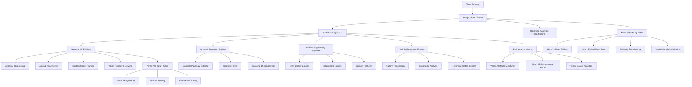

# Design Document

## Overview

The Advanced Predictive Analytics System is a comprehensive enhancement to the existing Transcript Analytics Platform that transforms it into an intelligent forecasting engine. This system leverages multiple machine learning algorithms, real-time anomaly detection, and automated insight generation to provide dynamic predictions and actionable business intelligence. The architecture integrates seamlessly with the existing Next.js 15 platform while adding sophisticated time-series forecasting, multi-dimensional analysis, and intelligent data modeling capabilities.

## Architecture

### High-Level Architecture



### Technology Stack Enhancement

**Core ML Platform:**
- **Google Vertex AI**: Managed ML platform for training and serving models
- **Vertex AI Forecasting**: Time-series forecasting with AutoML
- **Vertex AI Workbench**: Model development and experimentation
- **Vertex AI Pipelines**: ML workflow orchestration
- **Vertex AI Model Registry**: Model versioning and deployment

**Data Processing:**
- **Neon DB with pgvector**: Vector database for embeddings and similarity search
- **Vertex AI Feature Store**: Centralized feature management and serving
- **D3.js**: Data transformations and feature engineering
- **Date-fns**: Time-based feature extraction and date handling

**Visualization Enhancement:**
- **Recharts**: Enhanced with custom anomaly indicators and prediction bands
- **D3.js**: Custom interactive visualizations for multi-dimensional analysis
- **Framer Motion**: Smooth transitions for real-time data updates

**Performance Optimization:**
- **Vertex AI Endpoints**: Scalable model serving with auto-scaling
- **Neon DB Connection Pooling**: Optimized database connections
- **Vector Similarity Search**: Fast nearest neighbor queries with pgvector
- **Service Workers**: Offline prediction capabilities with cached models

## Components and Interfaces

### Core ML Engine Components

#### 1. Vertex AI Prediction Engine Manager
```typescript
interface VertexAIPredictionEngine {
  generateForecast(request: ForecastRequest): Promise<ForecastResult>
  deployModel(modelConfig: VertexAIModelConfig): Promise<ModelDeployment>
  updateModels(newData: TranscriptData[]): Promise<ModelUpdateResult>
  validatePredictions(predictions: Prediction[]): Promise<ValidationResult>
  queryFeatureStore(featureQuery: FeatureQuery): Promise<FeatureData>
}

interface ForecastRequest {
  clientId?: string
  timeHorizon: 'daily' | 'weekly' | 'monthly' | 'quarterly'
  periodsAhead: number
  confidenceLevel: number
  modelPreference?: ModelType[]
  customFilters?: PredictionFilters
}

interface ForecastResult {
  predictions: TimePrediction[]
  modelUsed: ModelType
  accuracy: ModelAccuracy
  confidenceIntervals: ConfidenceInterval[]
  seasonalityDetected: SeasonalPattern[]
  anomaliesDetected: AnomalyPoint[]
}
```

#### 2. Vertex AI Model Integration
```typescript
interface VertexAIModelService {
  createAutoMLForecastingModel(config: AutoMLConfig): Promise<ModelTrainingJob>
  deployModelToEndpoint(modelId: string, config: EndpointConfig): Promise<ModelEndpoint>
  batchPredict(modelEndpoint: string, data: TimeSeriesData): Promise<BatchPredictionJob>
  onlinePredict(modelEndpoint: string, instances: PredictionInstance[]): Promise<PredictionResponse>
  getModelEvaluation(modelId: string): Promise<ModelEvaluation>
}

class VertexAIForecastingService implements VertexAIModelService {
  private projectId: string
  private location: string
  private credentials: GoogleAuth
  
  async createAutoMLForecastingModel(config: AutoMLConfig): Promise<ModelTrainingJob> {
    // Create AutoML time-series forecasting model
    // Configure data source and target column
    // Set training parameters and optimization objective
  }
  
  async deployModelToEndpoint(modelId: string, config: EndpointConfig): Promise<ModelEndpoint> {
    // Deploy trained model to Vertex AI endpoint
    // Configure auto-scaling and resource allocation
    // Set up monitoring and logging
  }
  
  async onlinePredict(modelEndpoint: string, instances: PredictionInstance[]): Promise<PredictionResponse> {
    // Make real-time predictions via Vertex AI endpoint
    // Handle batch and streaming predictions
    // Apply post-processing and validation
  }
}

class VertexAIFeatureStore {
  private featureStoreId: string
  
  async createFeatureGroup(config: FeatureGroupConfig): Promise<FeatureGroup>
  async ingestFeatures(featureGroup: string, features: FeatureData[]): Promise<IngestionResult>
  async serveFeatures(featureQuery: FeatureQuery): Promise<FeatureVector>
  async monitorFeatureDrift(featureGroup: string): Promise<DriftAnalysis>
}
```

#### 3. Anomaly Detection System
```typescript
interface AnomalyDetectionService {
  detectAnomalies(data: TimeSeriesData): Promise<AnomalyResult>
  classifyAnomaly(point: DataPoint): Promise<AnomalyType>
  generateAlerts(anomalies: AnomalyPoint[]): Promise<Alert[]>
  updateDetectionThresholds(feedback: AnomalyFeedback[]): Promise<void>
}

interface AnomalyResult {
  anomalies: AnomalyPoint[]
  severity: 'low' | 'medium' | 'high' | 'critical'
  confidence: number
  detectionMethod: 'statistical' | 'isolation_forest' | 'seasonal_decomposition'
  recommendations: string[]
}

interface AnomalyPoint {
  timestamp: Date
  value: number
  expectedValue: number
  deviation: number
  type: 'point' | 'contextual' | 'collective'
  severity: number
  explanation: string
}

class StatisticalAnomalyDetector {
  async detectZScoreAnomalies(data: number[], threshold: number): Promise<AnomalyPoint[]>
  async detectIQRAnomalies(data: number[]): Promise<AnomalyPoint[]>
  async detectSeasonalAnomalies(data: TimeSeriesData): Promise<AnomalyPoint[]>
}

class IsolationForestDetector {
  private model: IsolationForest
  
  async train(data: TimeSeriesData): Promise<void>
  async detectAnomalies(data: TimeSeriesData): Promise<AnomalyPoint[]>
  async updateModel(newData: TimeSeriesData): Promise<void>
}
```

#### 4. Feature Engineering Pipeline
```typescript
interface FeatureEngineeringPipeline {
  generateTimeFeatures(data: TimeSeriesData): Promise<TimeFeatures>
  generateStatisticalFeatures(data: TimeSeriesData): Promise<StatisticalFeatures>
  generateDomainFeatures(data: TranscriptData[]): Promise<DomainFeatures>
  selectOptimalFeatures(features: AllFeatures, target: number[]): Promise<SelectedFeatures>
}

interface TimeFeatures {
  lags: number[]
  rollingMeans: number[]
  rollingStds: number[]
  seasonalIndicators: number[]
  trendComponents: number[]
  cyclicalComponents: number[]
}

interface StatisticalFeatures {
  autocorrelations: number[]
  partialAutocorrelations: number[]
  stationarityTests: StationarityResult[]
  seasonalityTests: SeasonalityResult[]
  changePoints: ChangePoint[]
}

interface DomainFeatures {
  clientSegments: string[]
  businessDayIndicators: number[]
  holidayEffects: number[]
  externalFactors: ExternalFactor[]
}

class AutoFeatureSelector {
  async selectFeatures(features: Feature[], target: number[]): Promise<SelectedFeatures>
  async rankFeatureImportance(features: Feature[], target: number[]): Promise<FeatureRanking[]>
  async performCrossValidation(features: Feature[], target: number[]): Promise<CVResult>
}
```

#### 5. Insight Generation Engine
```typescript
interface InsightGenerationEngine {
  generateInsights(data: AnalysisData): Promise<BusinessInsight[]>
  identifyKeyInfluencers(data: TimeSeriesData): Promise<Influencer[]>
  generateRecommendations(insights: BusinessInsight[]): Promise<Recommendation[]>
  createNaturalLanguageSummary(analysis: AnalysisResult): Promise<string>
}

interface BusinessInsight {
  id: string
  type: 'trend' | 'seasonal' | 'anomaly' | 'correlation' | 'forecast'
  title: string
  description: string
  confidence: number
  impact: 'low' | 'medium' | 'high'
  timeframe: DateRange
  supportingData: SupportingData
  visualizations: VisualizationConfig[]
}

interface Influencer {
  factor: string
  correlation: number
  significance: number
  direction: 'positive' | 'negative'
  timeDelay: number
  explanation: string
}

interface Recommendation {
  id: string
  priority: 'low' | 'medium' | 'high' | 'critical'
  category: 'operational' | 'strategic' | 'tactical'
  title: string
  description: string
  expectedImpact: string
  implementationEffort: 'low' | 'medium' | 'high'
  timeframe: string
  metrics: string[]
}

class NaturalLanguageGenerator {
  async generateTrendSummary(trend: TrendAnalysis): Promise<string>
  async generateAnomalySummary(anomalies: AnomalyPoint[]): Promise<string>
  async generateForecastSummary(forecast: ForecastResult): Promise<string>
  async generateRecommendationText(recommendation: Recommendation): Promise<string>
}
```

## Data Models

### Enhanced Database Schema

```sql
-- Enhanced schema for advanced predictive analytics with Neon DB and pgvector

-- Enable pgvector extension for vector operations
CREATE EXTENSION IF NOT EXISTS vector;

-- Vertex AI Models metadata
CREATE TABLE vertex_ai_models (
  id UUID PRIMARY KEY DEFAULT uuid_generate_v4(),
  vertex_model_id VARCHAR(255) NOT NULL UNIQUE,
  model_name VARCHAR(100) NOT NULL,
  model_type VARCHAR(50) NOT NULL, -- 'automl_forecasting', 'custom_training'
  endpoint_id VARCHAR(255),
  project_id VARCHAR(100) NOT NULL,
  location VARCHAR(50) NOT NULL,
  training_config JSONB NOT NULL,
  evaluation_metrics JSONB,
  feature_importance JSONB,
  created_at TIMESTAMP WITH TIME ZONE DEFAULT NOW(),
  updated_at TIMESTAMP WITH TIME ZONE DEFAULT NOW(),
  is_active BOOLEAN DEFAULT true,
  deployment_status VARCHAR(20) DEFAULT 'pending' -- 'pending', 'deployed', 'failed', 'retired'
);

-- Vector embeddings for similarity search and pattern matching
CREATE TABLE transcript_embeddings (
  id UUID PRIMARY KEY DEFAULT uuid_generate_v4(),
  transcript_id UUID REFERENCES transcripts(id) ON DELETE CASCADE,
  embedding vector(768), -- 768-dimensional embedding vector
  embedding_model VARCHAR(100) NOT NULL, -- Model used to generate embedding
  metadata JSONB, -- Additional context for the embedding
  created_at TIMESTAMP WITH TIME ZONE DEFAULT NOW(),
  INDEX USING ivfflat (embedding vector_cosine_ops) WITH (lists = 100)
);

-- Feature store for ML features
CREATE TABLE feature_store (
  id UUID PRIMARY KEY DEFAULT uuid_generate_v4(),
  feature_group VARCHAR(100) NOT NULL,
  feature_name VARCHAR(100) NOT NULL,
  entity_id VARCHAR(255) NOT NULL, -- client_id or other entity identifier
  feature_timestamp TIMESTAMP WITH TIME ZONE NOT NULL,
  feature_value JSONB NOT NULL,
  feature_vector vector(512), -- Optional vector representation
  created_at TIMESTAMP WITH TIME ZONE DEFAULT NOW(),
  UNIQUE(feature_group, feature_name, entity_id, feature_timestamp),
  INDEX(feature_group, entity_id, feature_timestamp),
  INDEX USING ivfflat (feature_vector vector_cosine_ops) WITH (lists = 50)
);

-- Enhanced predictions table with Vertex AI integration
CREATE TABLE vertex_ai_predictions (
  id UUID PRIMARY KEY DEFAULT uuid_generate_v4(),
  client_id UUID REFERENCES clients(id) ON DELETE CASCADE,
  vertex_model_id UUID REFERENCES vertex_ai_models(id),
  prediction_job_id VARCHAR(255), -- Vertex AI batch prediction job ID
  prediction_type VARCHAR(20) NOT NULL, -- 'daily', 'weekly', 'monthly', 'quarterly'
  forecast_horizon INTEGER NOT NULL,
  predicted_values JSONB NOT NULL, -- Array of {date, value, confidence_lower, confidence_upper}
  seasonality_detected JSONB, -- Seasonal patterns found
  model_confidence DECIMAL(5,4),
  prediction_embedding vector(384), -- Embedding of prediction pattern for similarity search
  accuracy_score DECIMAL(5,4),
  created_at TIMESTAMP WITH TIME ZONE DEFAULT NOW(),
  expires_at TIMESTAMP WITH TIME ZONE,
  INDEX(client_id, prediction_type, created_at),
  INDEX USING ivfflat (prediction_embedding vector_cosine_ops) WITH (lists = 50)
);

-- Anomaly detection results
CREATE TABLE anomalies (
  id UUID PRIMARY KEY DEFAULT uuid_generate_v4(),
  client_id UUID REFERENCES clients(id) ON DELETE CASCADE,
  detected_at TIMESTAMP WITH TIME ZONE NOT NULL,
  anomaly_type VARCHAR(20) NOT NULL, -- 'point', 'contextual', 'collective'
  severity VARCHAR(10) NOT NULL, -- 'low', 'medium', 'high', 'critical'
  actual_value DECIMAL(10,2) NOT NULL,
  expected_value DECIMAL(10,2) NOT NULL,
  deviation_score DECIMAL(8,4) NOT NULL,
  detection_method VARCHAR(50) NOT NULL,
  explanation TEXT,
  is_resolved BOOLEAN DEFAULT false,
  resolved_at TIMESTAMP WITH TIME ZONE,
  created_at TIMESTAMP WITH TIME ZONE DEFAULT NOW(),
  INDEX(client_id, detected_at, severity)
);

-- Feature importance tracking
CREATE TABLE feature_importance (
  id UUID PRIMARY KEY DEFAULT uuid_generate_v4(),
  model_id UUID REFERENCES ml_models(id) ON DELETE CASCADE,
  feature_name VARCHAR(100) NOT NULL,
  importance_score DECIMAL(8,6) NOT NULL,
  feature_type VARCHAR(50) NOT NULL, -- 'time', 'statistical', 'domain'
  created_at TIMESTAMP WITH TIME ZONE DEFAULT NOW(),
  INDEX(model_id, importance_score DESC)
);

-- Business insights
CREATE TABLE business_insights (
  id UUID PRIMARY KEY DEFAULT uuid_generate_v4(),
  client_id UUID REFERENCES clients(id) ON DELETE CASCADE,
  insight_type VARCHAR(20) NOT NULL,
  title VARCHAR(255) NOT NULL,
  description TEXT NOT NULL,
  confidence DECIMAL(3,2) NOT NULL,
  impact VARCHAR(10) NOT NULL, -- 'low', 'medium', 'high'
  time_range JSONB NOT NULL, -- {start_date, end_date}
  supporting_data JSONB,
  visualizations JSONB,
  is_active BOOLEAN DEFAULT true,
  created_at TIMESTAMP WITH TIME ZONE DEFAULT NOW(),
  INDEX(client_id, insight_type, created_at)
);

-- Recommendations
CREATE TABLE recommendations (
  id UUID PRIMARY KEY DEFAULT uuid_generate_v4(),
  insight_id UUID REFERENCES business_insights(id) ON DELETE CASCADE,
  priority VARCHAR(10) NOT NULL, -- 'low', 'medium', 'high', 'critical'
  category VARCHAR(20) NOT NULL, -- 'operational', 'strategic', 'tactical'
  title VARCHAR(255) NOT NULL,
  description TEXT NOT NULL,
  expected_impact TEXT,
  implementation_effort VARCHAR(10) NOT NULL, -- 'low', 'medium', 'high'
  timeframe VARCHAR(100),
  metrics JSONB, -- Array of metric names
  status VARCHAR(20) DEFAULT 'pending', -- 'pending', 'in_progress', 'completed', 'dismissed'
  created_at TIMESTAMP WITH TIME ZONE DEFAULT NOW(),
  INDEX(priority, status, created_at)
);

-- Vertex AI model performance tracking
CREATE TABLE vertex_ai_model_performance (
  id UUID PRIMARY KEY DEFAULT uuid_generate_v4(),
  vertex_model_id UUID REFERENCES vertex_ai_models(id) ON DELETE CASCADE,
  client_id UUID REFERENCES clients(id),
  evaluation_date TIMESTAMP WITH TIME ZONE NOT NULL,
  mae DECIMAL(10,4), -- Mean Absolute Error
  rmse DECIMAL(10,4), -- Root Mean Square Error
  mape DECIMAL(5,2), -- Mean Absolute Percentage Error
  accuracy_score DECIMAL(5,4),
  prediction_count INTEGER NOT NULL,
  endpoint_latency_ms INTEGER, -- Vertex AI endpoint response time
  feature_drift_score DECIMAL(5,4), -- Feature drift detection score
  model_drift_score DECIMAL(5,4), -- Model performance drift score
  created_at TIMESTAMP WITH TIME ZONE DEFAULT NOW(),
  INDEX(vertex_model_id, evaluation_date)
);

-- Vector similarity search for pattern matching
CREATE TABLE pattern_similarities (
  id UUID PRIMARY KEY DEFAULT uuid_generate_v4(),
  source_client_id UUID REFERENCES clients(id) ON DELETE CASCADE,
  target_client_id UUID REFERENCES clients(id) ON DELETE CASCADE,
  similarity_score DECIMAL(5,4) NOT NULL,
  pattern_type VARCHAR(50) NOT NULL, -- 'seasonal', 'trend', 'anomaly', 'forecast'
  time_period JSONB NOT NULL, -- {start_date, end_date}
  similarity_embedding vector(256), -- Embedding representing the similarity pattern
  created_at TIMESTAMP WITH TIME ZONE DEFAULT NOW(),
  INDEX(source_client_id, similarity_score DESC),
  INDEX USING ivfflat (similarity_embedding vector_cosine_ops) WITH (lists = 25)
);

-- External factors (for correlation analysis)
CREATE TABLE external_factors (
  id UUID PRIMARY KEY DEFAULT uuid_generate_v4(),
  factor_name VARCHAR(100) NOT NULL,
  factor_type VARCHAR(50) NOT NULL, -- 'holiday', 'weather', 'economic', 'seasonal'
  date DATE NOT NULL,
  value DECIMAL(10,4),
  description TEXT,
  source VARCHAR(100),
  created_at TIMESTAMP WITH TIME ZONE DEFAULT NOW(),
  UNIQUE(factor_name, date),
  INDEX(factor_name, date)
);

-- Prediction accuracy feedback
CREATE TABLE prediction_feedback (
  id UUID PRIMARY KEY DEFAULT uuid_generate_v4(),
  prediction_id UUID REFERENCES advanced_predictions(id) ON DELETE CASCADE,
  actual_date DATE NOT NULL,
  actual_value DECIMAL(10,2) NOT NULL,
  predicted_value DECIMAL(10,2) NOT NULL,
  absolute_error DECIMAL(10,2) NOT NULL,
  percentage_error DECIMAL(5,2) NOT NULL,
  created_at TIMESTAMP WITH TIME ZONE DEFAULT NOW(),
  INDEX(prediction_id, actual_date)
);
```

### TypeScript Interfaces

```typescript
// Enhanced data models for advanced analytics

interface TimeSeriesData {
  timestamps: Date[]
  values: number[]
  clientId?: string
  metadata?: Record<string, any>
  embedding?: number[] // Vector embedding for similarity search
}

interface VertexAIModelConfiguration {
  modelType: 'automl_forecasting' | 'custom_training'
  projectId: string
  location: string
  datasetId?: string
  targetColumn: string
  timeColumn: string
  featureColumns: string[]
  optimizationObjective: 'minimize_rmse' | 'minimize_mae' | 'minimize_mape'
  budgetMilliNodeHours?: number
  featureStoreConfig?: FeatureStoreConfiguration
}

interface FeatureConfiguration {
  timeFeatures: {
    lags: number[]
    rollingWindows: number[]
    seasonalPeriods: number[]
  }
  statisticalFeatures: {
    includeAutocorrelation: boolean
    includeStationarity: boolean
    includeChangePoints: boolean
  }
  domainFeatures: {
    includeBusinessDays: boolean
    includeHolidays: boolean
    includeExternalFactors: string[]
  }
}

interface VertexAIPredictionResult {
  id: string
  clientId: string
  vertexModelId: string
  predictionJobId?: string
  predictionType: 'daily' | 'weekly' | 'monthly' | 'quarterly'
  forecastHorizon: number
  predictions: TimePrediction[]
  seasonality: SeasonalPattern[]
  accuracy: ModelAccuracy
  modelConfidence: number
  predictionEmbedding?: number[] // Vector embedding for pattern similarity
  similarPatterns?: SimilarPattern[] // Similar patterns found via vector search
  createdAt: Date
  expiresAt: Date
}

interface SimilarPattern {
  clientId: string
  clientName: string
  similarityScore: number
  patternType: string
  timePeriod: DateRange
  explanation: string
}

interface FeatureStoreConfiguration {
  featureStoreId: string
  entityType: string
  featureGroups: FeatureGroupConfig[]
  servingConfig: FeatureServingConfig
}

interface VectorSearchQuery {
  embedding: number[]
  topK: number
  similarityThreshold: number
  filters?: Record<string, any>
}

interface VectorSearchResult {
  id: string
  similarity: number
  metadata: Record<string, any>
  embedding: number[]
}

interface TimePrediction {
  date: Date
  predictedValue: number
  confidenceInterval: {
    lower: number
    upper: number
  }
  seasonalComponent?: number
  trendComponent?: number
}

interface SeasonalPattern {
  type: 'daily' | 'weekly' | 'monthly' | 'yearly'
  strength: number
  period: number
  phase: number
}

interface ModelAccuracy {
  mae: number // Mean Absolute Error
  rmse: number // Root Mean Square Error
  mape: number // Mean Absolute Percentage Error
  r2Score: number // R-squared
  crossValidationScore: number
}

interface AnomalyDetectionResult {
  anomalies: DetectedAnomaly[]
  overallSeverity: 'low' | 'medium' | 'high' | 'critical'
  detectionSummary: string
  recommendedActions: string[]
}

interface DetectedAnomaly {
  id: string
  clientId: string
  timestamp: Date
  actualValue: number
  expectedValue: number
  deviationScore: number
  type: 'point' | 'contextual' | 'collective'
  severity: 'low' | 'medium' | 'high' | 'critical'
  detectionMethod: string
  explanation: string
  isResolved: boolean
}

interface InfluencerAnalysis {
  factors: InfluencingFactor[]
  correlationMatrix: CorrelationMatrix
  significanceTests: SignificanceTest[]
  recommendations: FactorRecommendation[]
}

interface InfluencingFactor {
  name: string
  correlation: number
  significance: number
  direction: 'positive' | 'negative'
  timeDelay: number
  confidence: number
  explanation: string
}

interface MultiDimensionalForecast {
  dimensions: ForecastDimension[]
  hierarchicalForecasts: HierarchicalForecast[]
  reconciliationMethod: 'bottom_up' | 'top_down' | 'middle_out'
  aggregatedForecast: PredictionResult
}

interface ForecastDimension {
  name: string
  values: string[]
  hierarchy?: string[]
}

interface HierarchicalForecast {
  level: number
  dimensionValue: string
  forecast: PredictionResult
  children?: HierarchicalForecast[]
}
```

## Error Handling

### Advanced Error Management

#### 1. ML Model Errors
```typescript
class ModelTrainingError extends Error {
  constructor(
    message: string,
    public modelType: string,
    public dataSize: number,
    public parameters: Record<string, any>
  ) {
    super(message)
    this.name = 'ModelTrainingError'
  }
}

class PredictionError extends Error {
  constructor(
    message: string,
    public modelId: string,
    public inputData: any,
    public expectedOutput: string
  ) {
    super(message)
    this.name = 'PredictionError'
  }
}

class DataQualityError extends Error {
  constructor(
    message: string,
    public issues: DataQualityIssue[],
    public affectedRecords: number
  ) {
    super(message)
    this.name = 'DataQualityError'
  }
}
```

#### 2. Error Recovery Strategies
```typescript
interface ErrorRecoveryStrategy {
  handleModelFailure(error: ModelTrainingError): Promise<RecoveryResult>
  handleDataQualityIssues(error: DataQualityError): Promise<DataCleaningResult>
  handlePredictionFailure(error: PredictionError): Promise<FallbackPrediction>
}

class AdaptiveErrorRecovery implements ErrorRecoveryStrategy {
  async handleModelFailure(error: ModelTrainingError): Promise<RecoveryResult> {
    // Try alternative model types
    // Adjust hyperparameters
    // Use ensemble approach as fallback
  }
  
  async handleDataQualityIssues(error: DataQualityError): Promise<DataCleaningResult> {
    // Apply data imputation
    // Remove outliers
    // Interpolate missing values
  }
  
  async handlePredictionFailure(error: PredictionError): Promise<FallbackPrediction> {
    // Use cached predictions
    // Apply simple statistical methods
    // Return confidence-adjusted results
  }
}
```

## Testing Strategy

### ML Model Testing Framework

#### 1. Model Validation Tests
```typescript
interface ModelTestSuite {
  testModelAccuracy(model: MLModelInterface, testData: TimeSeriesData): Promise<AccuracyTest>
  testModelStability(model: MLModelInterface, variations: DataVariation[]): Promise<StabilityTest>
  testModelGeneralization(model: MLModelInterface, crossValidationSets: TimeSeriesData[]): Promise<GeneralizationTest>
  testModelPerformance(model: MLModelInterface, benchmarkData: TimeSeriesData): Promise<PerformanceTest>
}

class ARIMAModelTests {
  async testOrderSelection(data: TimeSeriesData): Promise<OrderSelectionTest>
  async testStationarityRequirements(data: TimeSeriesData): Promise<StationarityTest>
  async testSeasonalityDetection(data: TimeSeriesData): Promise<SeasonalityTest>
}

class ProphetModelTests {
  async testSeasonalityComponents(data: TimeSeriesData): Promise<SeasonalityComponentTest>
  async testHolidayEffects(data: TimeSeriesData, holidays: Holiday[]): Promise<HolidayEffectTest>
  async testTrendChangepoints(data: TimeSeriesData): Promise<TrendChangepointTest>
}

class LSTMModelTests {
  async testArchitectureOptimization(data: TimeSeriesData): Promise<ArchitectureTest>
  async testSequenceLengthOptimization(data: TimeSeriesData): Promise<SequenceLengthTest>
  async testOverfittingPrevention(data: TimeSeriesData): Promise<OverfittingTest>
}
```

#### 2. Anomaly Detection Testing
```typescript
class AnomalyDetectionTests {
  async testFalsePositiveRate(detector: AnomalyDetectionService, normalData: TimeSeriesData): Promise<FalsePositiveTest>
  async testTruePositiveRate(detector: AnomalyDetectionService, anomalyData: TimeSeriesData): Promise<TruePositiveTest>
  async testSensitivityAnalysis(detector: AnomalyDetectionService, thresholds: number[]): Promise<SensitivityTest>
}
```

#### 3. Integration Testing
```typescript
class PredictionPipelineTests {
  async testEndToEndPrediction(data: TranscriptData[]): Promise<E2EPredictionTest>
  async testRealTimeUpdates(streamingData: TimeSeriesData): Promise<RealTimeTest>
  async testMultiClientPredictions(clientData: Map<string, TimeSeriesData>): Promise<MultiClientTest>
}
```

## Performance Considerations

### Optimization Strategies

#### 1. Vertex AI Model Performance Optimization
```typescript
interface VertexAIOptimizationStrategy {
  optimizeEndpointPerformance(endpointId: string): Promise<EndpointOptimizationResult>
  optimizeBatchPredictions(jobConfig: BatchPredictionConfig): Promise<BatchOptimizationResult>
  optimizeFeatureServing(featureQuery: FeatureQuery): Promise<FeatureServingOptimization>
  optimizeVectorSearch(query: VectorSearchQuery): Promise<VectorSearchOptimization>
}

class VertexAIPerformanceOptimizer implements VertexAIOptimizationStrategy {
  async optimizeEndpointPerformance(endpointId: string): Promise<EndpointOptimizationResult> {
    // Configure auto-scaling policies
    // Optimize machine types and resource allocation
    // Implement request batching and caching
    // Monitor and adjust traffic splitting
  }
  
  async optimizeBatchPredictions(jobConfig: BatchPredictionConfig): Promise<BatchOptimizationResult> {
    // Optimize batch size and parallelization
    // Use appropriate machine types for workload
    // Implement data preprocessing optimization
    // Configure output storage efficiently
  }
  
  async optimizeFeatureServing(featureQuery: FeatureQuery): Promise<FeatureServingOptimization> {
    // Cache frequently accessed features
    // Optimize feature store queries
    // Implement feature precomputation
    // Use feature streaming for real-time scenarios
  }
  
  async optimizeVectorSearch(query: VectorSearchQuery): Promise<VectorSearchOptimization> {
    // Optimize pgvector index configuration
    // Implement embedding caching strategies
    // Use approximate nearest neighbor search
    // Batch vector operations for efficiency
  }
}
```

#### 2. Real-time Processing
```typescript
class RealTimeProcessor {
  private webWorkers: Worker[]
  private predictionCache: Map<string, CachedPrediction>
  
  async processStreamingData(data: StreamingData): Promise<ProcessingResult> {
    // Use Web Workers for parallel processing
    // Implement sliding window analysis
    // Use incremental model updates
    // Cache intermediate results
  }
  
  async updatePredictionsIncrementally(newData: DataPoint[]): Promise<UpdateResult> {
    // Update only affected predictions
    // Use differential computation
    // Implement smart cache invalidation
  }
}
```

#### 3. Neon DB and Vector Caching Strategy
```typescript
interface AdvancedCacheStrategy {
  cachePrediction(key: string, prediction: VertexAIPredictionResult): Promise<void>
  getCachedPrediction(key: string): Promise<VertexAIPredictionResult | null>
  cacheVectorEmbedding(id: string, embedding: number[]): Promise<void>
  findSimilarPredictions(embedding: number[], threshold: number): Promise<SimilarPattern[]>
  invalidateCache(pattern: string): Promise<void>
  optimizeCacheSize(): Promise<CacheOptimizationResult>
}

class NeonDBVectorCache implements AdvancedCacheStrategy {
  private neonPool: Pool
  private memoryCache: Map<string, CachedPrediction>
  
  async cachePrediction(key: string, prediction: VertexAIPredictionResult): Promise<void> {
    // Store in Neon DB with vector embedding
    // Cache frequently accessed predictions in memory
    // Set TTL based on prediction volatility
    // Index embeddings for similarity search
  }
  
  async findSimilarPredictions(embedding: number[], threshold: number): Promise<SimilarPattern[]> {
    // Use pgvector cosine similarity search
    // Query: SELECT * FROM predictions ORDER BY embedding <-> $1 LIMIT 10
    // Apply similarity threshold filtering
    // Return ranked similar patterns
  }
  
  async cacheVectorEmbedding(id: string, embedding: number[]): Promise<void> {
    // Store embedding in pgvector column
    // Update vector index for fast similarity search
    // Maintain embedding metadata and versioning
  }
}
```

## Security Considerations

### ML Model Security

#### 1. Model Protection
```typescript
interface ModelSecurityService {
  validateModelInputs(inputs: any[]): Promise<ValidationResult>
  sanitizeFeatureData(features: FeatureData): Promise<SanitizedFeatureData>
  protectModelParameters(model: MLModelInterface): Promise<ProtectedModel>
  auditModelAccess(userId: string, modelId: string, action: string): Promise<void>
}

class ModelSecurityManager implements ModelSecurityService {
  async validateModelInputs(inputs: any[]): Promise<ValidationResult> {
    // Validate input ranges
    // Check for injection attacks
    // Sanitize numerical inputs
    // Validate data types
  }
  
  async sanitizeFeatureData(features: FeatureData): Promise<SanitizedFeatureData> {
    // Remove sensitive information
    // Normalize data ranges
    // Apply differential privacy if needed
  }
}
```

#### 2. Prediction Security
```typescript
class PredictionSecurityService {
  async validatePredictionRequest(request: ForecastRequest, userId: string): Promise<boolean> {
    // Check user permissions
    // Validate request parameters
    // Rate limit prediction requests
    // Audit prediction access
  }
  
  async sanitizePredictionOutput(prediction: PredictionResult): Promise<PredictionResult> {
    // Remove sensitive metadata
    // Apply output validation
    // Ensure data consistency
  }
}
```

## Multi-Dimensional Forecasting

### Hierarchical Prediction System

#### 1. Dimension Management
```typescript
interface DimensionManager {
  defineDimensions(config: DimensionConfiguration): Promise<DimensionDefinition[]>
  buildHierarchy(dimensions: DimensionDefinition[]): Promise<HierarchyTree>
  validateHierarchy(hierarchy: HierarchyTree): Promise<ValidationResult>
}

interface DimensionConfiguration {
  dimensions: {
    name: string
    type: 'categorical' | 'geographical' | 'temporal'
    values: string[]
    hierarchy?: HierarchyLevel[]
  }[]
  aggregationRules: AggregationRule[]
}

class HierarchicalForecaster {
  async generateHierarchicalForecasts(
    data: MultiDimensionalData,
    hierarchy: HierarchyTree
  ): Promise<HierarchicalForecastResult> {
    // Generate forecasts at each level
    // Apply reconciliation methods
    // Ensure forecast consistency
    // Optimize forecast accuracy
  }
  
  async reconcileForecasts(
    forecasts: Map<string, PredictionResult>,
    method: 'bottom_up' | 'top_down' | 'middle_out'
  ): Promise<ReconciledForecasts> {
    // Apply selected reconciliation method
    // Maintain hierarchical constraints
    // Optimize overall accuracy
  }
}
```

#### 2. Cross-Sectional Analysis
```typescript
class CrossSectionalAnalyzer {
  async analyzeAcrossDimensions(
    data: MultiDimensionalData,
    dimensions: string[]
  ): Promise<CrossSectionalAnalysis> {
    // Compare performance across segments
    // Identify outlier segments
    // Analyze correlation between dimensions
    // Generate comparative insights
  }
  
  async generateComparativeInsights(
    analysis: CrossSectionalAnalysis
  ): Promise<ComparativeInsight[]> {
    // Identify best/worst performing segments
    // Analyze growth patterns
    // Detect emerging trends
    // Generate actionable recommendations
  }
}
```

This comprehensive design provides the foundation for building an advanced predictive analytics system that meets all the requirements while integrating seamlessly with the existing platform architecture.