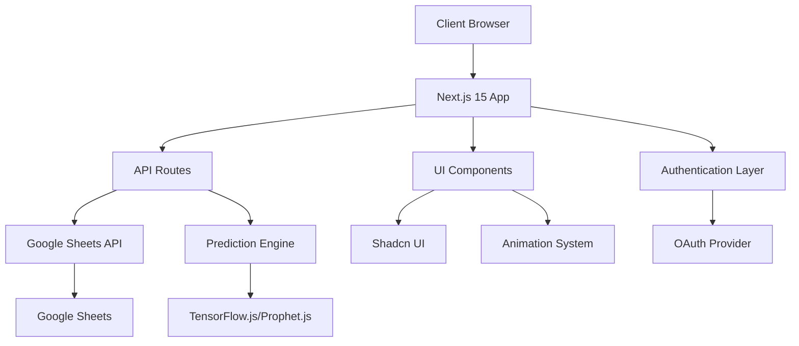

# Design Document

## Overview

The Transcript Analytics Platform is a modern web application built with Next.js 15 that provides predictive analytics for client transcript data. The application follows a client-server architecture with Google Sheets as the initial data source, OAuth-based authentication, and machine learning capabilities for forecasting. The platform emphasizes user experience through Shadcn UI components and micro animations while maintaining scalability for future database migration.

## Architecture

### High-Level Architecture



### Technology Stack

- **Frontend Framework**: Next.js 15 with App Router
- **Authentication**: NextAuth.js with OAuth providers (Auth0/Firebase)
- **UI Framework**: Shadcn UI with Tailwind CSS
- **Animation**: Framer Motion for micro animations
- **Data Fetching**: TanStack Query (React Query)
- **State Management**: React useState and useContext
- **Form Validation**: Zod with React Hook Form
- **Charts**: Recharts or Chart.js
- **Prediction Engine**: TensorFlow.js or Prophet.js
- **Data Source**: Google Sheets API (with database migration path)

## Components and Interfaces

### Core Components

#### 1. Authentication System
```typescript
interface AuthConfig {
  providers: OAuthProvider[]
  callbacks: AuthCallbacks
  session: SessionConfig
}

interface User {
  id: string
  email: string
  name: string
  image?: string
  role: 'admin' | 'user'
}
```

#### 2. Data Models
```typescript
interface TranscriptData {
  clientName: string
  month: string
  year: number
  transcriptCount: number
  createdAt: Date
  updatedAt: Date
}

interface PredictionResult {
  clientName: string
  predictions: MonthlyPrediction[]
  confidence: number
  accuracy: number
  model: 'linear' | 'polynomial' | 'arima'
}

interface MonthlyPrediction {
  month: string
  year: number
  predictedCount: number
  confidenceInterval: {
    lower: number
    upper: number
  }
}
```

#### 3. UI Components Structure
```
components/
├── ui/                    # Shadcn UI components
├── auth/
│   ├── LoginButton.tsx
│   ├── UserProfile.tsx
│   └── ProtectedRoute.tsx
├── dashboard/
│   ├── DashboardLayout.tsx
│   ├── MetricsCards.tsx
│   └── QuickActions.tsx
├── data/
│   ├── DataTable.tsx
│   ├── DataForm.tsx
│   └── ImportData.tsx
├── analytics/
│   ├── TrendChart.tsx
│   ├── PredictionChart.tsx
│   └── ClientAnalytics.tsx
├── animations/
│   ├── PageTransition.tsx
│   ├── LoadingSpinner.tsx
│   └── AnimatedCard.tsx
└── forms/
    ├── TranscriptForm.tsx
    └── ValidationSchemas.ts
```

### API Design

#### REST API Endpoints
```typescript
// Data Management
GET    /api/transcripts              // Get all transcript data
POST   /api/transcripts              // Add new transcript data
PUT    /api/transcripts/:id          // Update transcript data
DELETE /api/transcripts/:id          // Delete transcript data

// Analytics
GET    /api/analytics/trends         // Get trend analysis
GET    /api/analytics/predictions    // Get predictions
POST   /api/analytics/predict        // Generate new predictions

// Google Sheets Integration
GET    /api/sheets/sync              // Sync with Google Sheets
POST   /api/sheets/import            // Import from Google Sheets
```

#### Data Service Layer
```typescript
interface DataService {
  fetchTranscripts(): Promise<TranscriptData[]>
  addTranscript(data: TranscriptData): Promise<void>
  updateTranscript(id: string, data: Partial<TranscriptData>): Promise<void>
  deleteTranscript(id: string): Promise<void>
  syncWithSheets(): Promise<void>
}

interface PredictionService {
  generatePredictions(data: TranscriptData[]): Promise<PredictionResult[]>
  trainModel(data: TranscriptData[]): Promise<ModelMetrics>
  validatePredictions(predictions: PredictionResult[]): Promise<ValidationResult>
}
```

## Data Models

### Google Sheets Schema
```
Sheet: "Transcript Data"
Columns:
- A: Client Name (string)
- B: Month (string, format: "YYYY-MM")
- C: Transcript Count (number)
- D: Created Date (date)
- E: Updated Date (date)
- F: Notes (string, optional)
```

### Database Schema (Future Migration)
```sql
-- PostgreSQL Schema
CREATE TABLE clients (
  id UUID PRIMARY KEY DEFAULT gen_random_uuid(),
  name VARCHAR(255) NOT NULL UNIQUE,
  created_at TIMESTAMP DEFAULT NOW(),
  updated_at TIMESTAMP DEFAULT NOW()
);

CREATE TABLE transcripts (
  id UUID PRIMARY KEY DEFAULT gen_random_uuid(),
  client_id UUID REFERENCES clients(id),
  month DATE NOT NULL,
  count INTEGER NOT NULL CHECK (count >= 0),
  created_at TIMESTAMP DEFAULT NOW(),
  updated_at TIMESTAMP DEFAULT NOW(),
  UNIQUE(client_id, month)
);

CREATE TABLE predictions (
  id UUID PRIMARY KEY DEFAULT gen_random_uuid(),
  client_id UUID REFERENCES clients(id),
  predicted_month DATE NOT NULL,
  predicted_count INTEGER NOT NULL,
  confidence_lower INTEGER NOT NULL,
  confidence_upper INTEGER NOT NULL,
  model_type VARCHAR(50) NOT NULL,
  accuracy DECIMAL(5,4),
  created_at TIMESTAMP DEFAULT NOW()
);
```

### Zod Validation Schemas
```typescript
const TranscriptSchema = z.object({
  clientName: z.string().min(1, "Client name is required").max(100),
  month: z.string().regex(/^\d{4}-\d{2}$/, "Month must be in YYYY-MM format"),
  transcriptCount: z.number().int().min(0, "Count must be non-negative"),
  notes: z.string().optional()
})

const PredictionRequestSchema = z.object({
  clientName: z.string().optional(),
  monthsAhead: z.number().int().min(1).max(12).default(6),
  modelType: z.enum(['linear', 'polynomial', 'arima']).default('linear')
})
```

## Error Handling

### Error Types and Handling Strategy

#### 1. Authentication Errors
```typescript
class AuthenticationError extends Error {
  constructor(message: string, public code: string) {
    super(message)
    this.name = 'AuthenticationError'
  }
}

// Handle with redirect to login and user-friendly messages
```

#### 2. Data Validation Errors
```typescript
class ValidationError extends Error {
  constructor(message: string, public field: string, public value: any) {
    super(message)
    this.name = 'ValidationError'
  }
}

// Handle with form field highlighting and specific error messages
```

#### 3. API Integration Errors
```typescript
class APIError extends Error {
  constructor(message: string, public status: number, public endpoint: string) {
    super(message)
    this.name = 'APIError'
  }
}

// Handle with retry mechanisms and fallback strategies
```

#### 4. Prediction Model Errors
```typescript
class PredictionError extends Error {
  constructor(message: string, public modelType: string, public dataSize: number) {
    super(message)
    this.name = 'PredictionError'
  }
}

// Handle with alternative models and data quality suggestions
```

### Error Boundary Implementation
```typescript
interface ErrorBoundaryState {
  hasError: boolean
  error?: Error
  errorInfo?: ErrorInfo
}

// Global error boundary with user-friendly fallback UI
// Specific error boundaries for critical sections (auth, data, predictions)
```

## Testing Strategy

### Testing Pyramid

#### 1. Unit Tests (70%)
- **Components**: Test individual UI components with React Testing Library
- **Utilities**: Test data transformation and validation functions
- **Hooks**: Test custom React hooks with React Hooks Testing Library
- **API Routes**: Test Next.js API routes with Jest and supertest

#### 2. Integration Tests (20%)
- **Authentication Flow**: Test complete login/logout process
- **Data Flow**: Test data fetching, caching, and updates
- **Form Submission**: Test form validation and submission
- **Google Sheets Integration**: Test API integration with mocked responses

#### 3. End-to-End Tests (10%)
- **User Journeys**: Test complete user workflows with Playwright
- **Cross-browser Testing**: Ensure compatibility across browsers
- **Performance Testing**: Test loading times and responsiveness
- **Accessibility Testing**: Ensure WCAG compliance

### Test Configuration
```typescript
// Jest configuration for unit and integration tests
// Playwright configuration for E2E tests
// MSW (Mock Service Worker) for API mocking
// Testing Library utilities for component testing
```

### Prediction Model Testing
```typescript
interface ModelTestSuite {
  accuracy: number
  precision: number
  recall: number
  meanAbsoluteError: number
  rootMeanSquareError: number
}

// Test with historical data splits
// Validate prediction accuracy against known outcomes
// Test edge cases (insufficient data, outliers, seasonal patterns)
```

## Performance Considerations

### Optimization Strategies

#### 1. Data Loading
- Implement pagination for large datasets
- Use TanStack Query for intelligent caching
- Implement background data synchronization
- Lazy load prediction calculations

#### 2. UI Performance
- Use React.memo for expensive components
- Implement virtual scrolling for large tables
- Optimize animation performance with transform properties
- Use Suspense boundaries for code splitting

#### 3. Prediction Performance
- Cache prediction results with appropriate TTL
- Implement incremental model updates
- Use Web Workers for heavy calculations
- Optimize model size and complexity

#### 4. Bundle Optimization
- Implement dynamic imports for prediction libraries
- Use Next.js built-in optimizations
- Optimize images and assets
- Implement service worker for offline capabilities

## Security Considerations

### Authentication Security
- Implement CSRF protection
- Use secure session management
- Implement rate limiting
- Validate OAuth tokens properly

### Data Security
- Sanitize all user inputs
- Implement proper authorization checks
- Use HTTPS for all communications
- Secure Google Sheets API credentials

### Client-Side Security
- Implement Content Security Policy
- Sanitize data before rendering
- Protect against XSS attacks
- Secure local storage usage

## Migration Strategy

### Google Sheets to Database Migration

#### Phase 1: Dual Write
- Implement database schema
- Write to both Google Sheets and database
- Validate data consistency

#### Phase 2: Read Migration
- Gradually shift reads to database
- Maintain Google Sheets as backup
- Monitor performance improvements

#### Phase 3: Complete Migration
- Remove Google Sheets dependencies
- Implement database-specific optimizations
- Archive Google Sheets data

### Migration Tools
```typescript
interface MigrationService {
  exportFromSheets(): Promise<TranscriptData[]>
  importToDatabase(data: TranscriptData[]): Promise<void>
  validateMigration(): Promise<ValidationReport>
  rollbackMigration(): Promise<void>
}
```