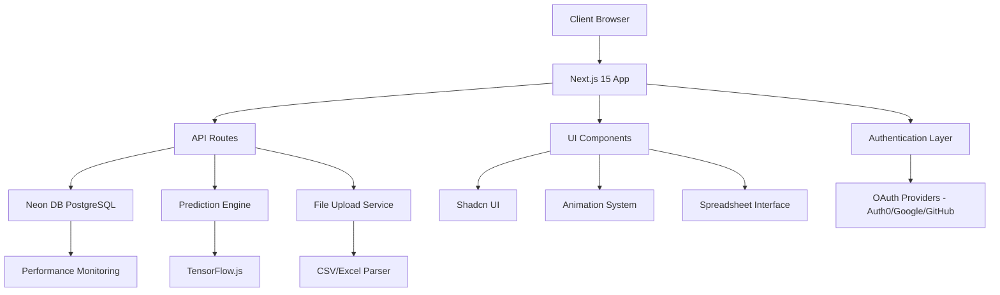

# Design Document

## Overview

The Transcript Analytics Platform is a modern web application built with Next.js 15 that provides comprehensive predictive analytics for client transcript data. The application follows a client-server architecture with Neon DB (PostgreSQL) as the primary database, multi-provider OAuth authentication, and TensorFlow.js-powered machine learning capabilities. The platform features a Google Sheets-like interface for data entry, role-based access control, and real-time performance monitoring while emphasizing user experience through Shadcn UI components and micro animations.

## Architecture

### High-Level Architecture



### Technology Stack

- **Frontend Framework**: Next.js 15 with App Router and Turbopack
- **Database**: Neon DB (Serverless PostgreSQL)
- **Authentication**: NextAuth.js with OAuth providers (Auth0, Google, GitHub)
- **UI Framework**: Shadcn UI with Tailwind CSS 4
- **Animation**: Framer Motion for micro animations
- **Data Fetching**: TanStack Query (React Query)
- **State Management**: React useState and useContext
- **Form Validation**: Zod with React Hook Form
- **Charts**: Recharts, D3.js, or Chart.js
- **Prediction Engine**: TensorFlow.js
- **Spreadsheet Interface**: Custom grid component with cell editing
- **File Processing**: CSV/Excel parsers for data import
- **Performance Monitoring**: Built-in metrics collection

## Components and Interfaces

### Core Components

#### 1. Authentication System
```typescript
interface AuthConfig {
  providers: OAuthProvider[]
  callbacks: AuthCallbacks
  session: SessionConfig
}

interface User {
  id: string
  email: string
  name: string
  image?: string
  role: 'admin' | 'user'
}
```

#### 2. Data Models
```typescript
interface User {
  id: string
  email: string
  name: string
  image?: string
  role: 'admin' | 'analyst' | 'viewer'
  createdAt: Date
  updatedAt: Date
}

interface TranscriptData {
  id: string
  clientName: string
  date: Date
  transcriptCount: number
  transcriptType?: string
  notes?: string
  createdAt: Date
  updatedAt: Date
  createdBy: string
}

interface PredictionResult {
  id: string
  clientName: string
  predictionType: 'daily' | 'weekly' | 'monthly'
  predictions: TimePrediction[]
  confidence: number
  accuracy: number
  modelType: 'linear' | 'polynomial' | 'arima'
  createdAt: Date
}

interface TimePrediction {
  date: Date
  predictedCount: number
  confidenceInterval: {
    lower: number
    upper: number
  }
}

interface PerformanceMetrics {
  id: string
  timestamp: Date
  queriesPerSecond: number
  modelRuntime: number
  dataSyncLatency: number
  errorCount: number
  activeUsers: number
}
```

#### 3. UI Components Structure
```
components/
├── ui/                    # Shadcn UI components
├── auth/
│   ├── LoginButton.tsx
│   ├── UserProfile.tsx
│   ├── ProtectedRoute.tsx
│   └── RoleGuard.tsx
├── dashboard/
│   ├── DashboardLayout.tsx
│   ├── MetricsCards.tsx
│   ├── QuickActions.tsx
│   └── PerformanceMonitor.tsx
├── data/
│   ├── SpreadsheetGrid.tsx    # Google Sheets-like interface
│   ├── DataTable.tsx
│   ├── FileUpload.tsx         # CSV/Excel upload
│   ├── ImportWizard.tsx
│   └── DataExport.tsx
├── analytics/
│   ├── TrendChart.tsx
│   ├── PredictionChart.tsx
│   ├── ClientAnalytics.tsx
│   ├── RealtimeDashboard.tsx
│   └── ExportReports.tsx
├── animations/
│   ├── PageTransition.tsx
│   ├── LoadingSpinner.tsx
│   └── AnimatedCard.tsx
├── monitoring/
│   ├── AdminDashboard.tsx
│   ├── PerformanceCharts.tsx
│   └── AlertSystem.tsx
└── forms/
    ├── TranscriptForm.tsx
    ├── ValidationSchemas.ts
    └── CellEditor.tsx
```

### API Design

#### REST API Endpoints
```typescript
// Authentication & Users
GET    /api/auth/session             // Get current user session
POST   /api/auth/signin              // Sign in user
POST   /api/auth/signout             // Sign out user
GET    /api/users                    // Get users (admin only)
PUT    /api/users/:id/role           // Update user role (admin only)

// Data Management
GET    /api/transcripts              // Get transcript data with filters
POST   /api/transcripts              // Add new transcript data
PUT    /api/transcripts/:id          // Update transcript data
DELETE /api/transcripts/:id          // Delete transcript data
POST   /api/transcripts/bulk         // Bulk insert from spreadsheet

// File Operations
POST   /api/upload/csv               // Upload CSV file
POST   /api/upload/excel             // Upload Excel file
GET    /api/export/csv               // Export data as CSV
GET    /api/export/pdf               // Export analytics as PDF

// Analytics
GET    /api/analytics/trends         // Get trend analysis
GET    /api/analytics/predictions    // Get predictions
POST   /api/analytics/predict        // Generate new predictions
GET    /api/analytics/summary        // Get summary statistics

// Performance Monitoring
GET    /api/monitoring/metrics       // Get performance metrics
GET    /api/monitoring/health        // System health check
POST   /api/monitoring/alert         // Create performance alert
```

#### Data Service Layer
```typescript
interface DataService {
  fetchTranscripts(): Promise<TranscriptData[]>
  addTranscript(data: TranscriptData): Promise<void>
  updateTranscript(id: string, data: Partial<TranscriptData>): Promise<void>
  deleteTranscript(id: string): Promise<void>
  syncWithSheets(): Promise<void>
}

interface PredictionService {
  generatePredictions(data: TranscriptData[]): Promise<PredictionResult[]>
  trainModel(data: TranscriptData[]): Promise<ModelMetrics>
  validatePredictions(predictions: PredictionResult[]): Promise<ValidationResult>
}
```

## Data Models

### Neon DB Schema (PostgreSQL)
```sql
-- Users and Authentication
CREATE TABLE users (
  id UUID PRIMARY KEY DEFAULT gen_random_uuid(),
  email VARCHAR(255) NOT NULL UNIQUE,
  name VARCHAR(255) NOT NULL,
  image TEXT,
  role VARCHAR(20) NOT NULL DEFAULT 'viewer' CHECK (role IN ('admin', 'analyst', 'viewer')),
  created_at TIMESTAMP DEFAULT NOW(),
  updated_at TIMESTAMP DEFAULT NOW()
);

-- Clients
CREATE TABLE clients (
  id UUID PRIMARY KEY DEFAULT gen_random_uuid(),
  name VARCHAR(255) NOT NULL UNIQUE,
  created_at TIMESTAMP DEFAULT NOW(),
  updated_at TIMESTAMP DEFAULT NOW()
);

-- Transcript Data
CREATE TABLE transcripts (
  id UUID PRIMARY KEY DEFAULT gen_random_uuid(),
  client_id UUID REFERENCES clients(id) ON DELETE CASCADE,
  date DATE NOT NULL,
  transcript_count INTEGER NOT NULL CHECK (transcript_count >= 0),
  transcript_type VARCHAR(100),
  notes TEXT,
  created_at TIMESTAMP DEFAULT NOW(),
  updated_at TIMESTAMP DEFAULT NOW(),
  created_by UUID REFERENCES users(id),
  UNIQUE(client_id, date)
);

-- ML Predictions
CREATE TABLE predictions (
  id UUID PRIMARY KEY DEFAULT gen_random_uuid(),
  client_id UUID REFERENCES clients(id) ON DELETE CASCADE,
  prediction_type VARCHAR(20) NOT NULL CHECK (prediction_type IN ('daily', 'weekly', 'monthly')),
  predicted_date DATE NOT NULL,
  predicted_count INTEGER NOT NULL,
  confidence_lower INTEGER NOT NULL,
  confidence_upper INTEGER NOT NULL,
  model_type VARCHAR(50) NOT NULL,
  accuracy DECIMAL(5,4),
  created_at TIMESTAMP DEFAULT NOW(),
  created_by UUID REFERENCES users(id)
);

-- Performance Monitoring
CREATE TABLE performance_metrics (
  id UUID PRIMARY KEY DEFAULT gen_random_uuid(),
  timestamp TIMESTAMP DEFAULT NOW(),
  queries_per_second DECIMAL(10,2),
  model_runtime DECIMAL(10,3),
  data_sync_latency DECIMAL(10,3),
  error_count INTEGER DEFAULT 0,
  active_users INTEGER DEFAULT 0,
  memory_usage DECIMAL(10,2),
  cpu_usage DECIMAL(5,2)
);

-- Indexes for performance
CREATE INDEX idx_transcripts_client_date ON transcripts(client_id, date);
CREATE INDEX idx_transcripts_date ON transcripts(date);
CREATE INDEX idx_predictions_client_date ON predictions(client_id, predicted_date);
CREATE INDEX idx_performance_timestamp ON performance_metrics(timestamp);
CREATE INDEX idx_users_email ON users(email);
```

### Zod Validation Schemas
```typescript
const UserSchema = z.object({
  email: z.string().email("Invalid email format"),
  name: z.string().min(1, "Name is required").max(255),
  role: z.enum(['admin', 'analyst', 'viewer']).default('viewer')
})

const TranscriptSchema = z.object({
  clientName: z.string().min(1, "Client name is required").max(255),
  date: z.date(),
  transcriptCount: z.number().int().min(0, "Count must be non-negative"),
  transcriptType: z.string().max(100).optional(),
  notes: z.string().optional()
})

const BulkTranscriptSchema = z.array(TranscriptSchema).min(1, "At least one record required")

const PredictionRequestSchema = z.object({
  clientName: z.string().optional(),
  predictionType: z.enum(['daily', 'weekly', 'monthly']).default('monthly'),
  periodsAhead: z.number().int().min(1).max(365).default(30),
  modelType: z.enum(['linear', 'polynomial', 'arima']).default('linear')
})

const FileUploadSchema = z.object({
  file: z.instanceof(File),
  fileType: z.enum(['csv', 'excel']),
  hasHeaders: z.boolean().default(true),
  dateFormat: z.string().default('YYYY-MM-DD')
})

const ExportRequestSchema = z.object({
  format: z.enum(['csv', 'pdf']),
  dateRange: z.object({
    start: z.date(),
    end: z.date()
  }).optional(),
  clients: z.array(z.string()).optional(),
  includeAnalytics: z.boolean().default(false)
})
```

## Error Handling

### Error Types and Handling Strategy

#### 1. Authentication Errors
```typescript
class AuthenticationError extends Error {
  constructor(message: string, public code: string) {
    super(message)
    this.name = 'AuthenticationError'
  }
}

// Handle with redirect to login and user-friendly messages
```

#### 2. Data Validation Errors
```typescript
class ValidationError extends Error {
  constructor(message: string, public field: string, public value: any) {
    super(message)
    this.name = 'ValidationError'
  }
}

// Handle with form field highlighting and specific error messages
```

#### 3. API Integration Errors
```typescript
class APIError extends Error {
  constructor(message: string, public status: number, public endpoint: string) {
    super(message)
    this.name = 'APIError'
  }
}

// Handle with retry mechanisms and fallback strategies
```

#### 4. Prediction Model Errors
```typescript
class PredictionError extends Error {
  constructor(message: string, public modelType: string, public dataSize: number) {
    super(message)
    this.name = 'PredictionError'
  }
}

// Handle with alternative models and data quality suggestions
```

### Error Boundary Implementation
```typescript
interface ErrorBoundaryState {
  hasError: boolean
  error?: Error
  errorInfo?: ErrorInfo
}

// Global error boundary with user-friendly fallback UI
// Specific error boundaries for critical sections (auth, data, predictions)
```

## Testing Strategy

### Testing Pyramid

#### 1. Unit Tests (70%)
- **Components**: Test individual UI components with React Testing Library
- **Utilities**: Test data transformation and validation functions
- **Hooks**: Test custom React hooks with React Hooks Testing Library
- **API Routes**: Test Next.js API routes with Jest and supertest

#### 2. Integration Tests (20%)
- **Authentication Flow**: Test complete login/logout process
- **Data Flow**: Test data fetching, caching, and updates
- **Form Submission**: Test form validation and submission
- **Google Sheets Integration**: Test API integration with mocked responses

#### 3. End-to-End Tests (10%)
- **User Journeys**: Test complete user workflows with Playwright
- **Cross-browser Testing**: Ensure compatibility across browsers
- **Performance Testing**: Test loading times and responsiveness
- **Accessibility Testing**: Ensure WCAG compliance

### Test Configuration
```typescript
// Jest configuration for unit and integration tests
// Playwright configuration for E2E tests
// MSW (Mock Service Worker) for API mocking
// Testing Library utilities for component testing
```

### Prediction Model Testing
```typescript
interface ModelTestSuite {
  accuracy: number
  precision: number
  recall: number
  meanAbsoluteError: number
  rootMeanSquareError: number
}

// Test with historical data splits
// Validate prediction accuracy against known outcomes
// Test edge cases (insufficient data, outliers, seasonal patterns)
```

## Performance Considerations

### Optimization Strategies

#### 1. Data Loading
- Implement pagination for large datasets
- Use TanStack Query for intelligent caching
- Implement background data synchronization
- Lazy load prediction calculations

#### 2. UI Performance
- Use React.memo for expensive components
- Implement virtual scrolling for large tables
- Optimize animation performance with transform properties
- Use Suspense boundaries for code splitting

#### 3. Prediction Performance
- Cache prediction results with appropriate TTL
- Implement incremental model updates
- Use Web Workers for heavy calculations
- Optimize model size and complexity

#### 4. Bundle Optimization
- Implement dynamic imports for prediction libraries
- Use Next.js built-in optimizations
- Optimize images and assets
- Implement service worker for offline capabilities

## Google Sheets-like Interface Design

### Spreadsheet Grid Component
```typescript
interface SpreadsheetGridProps {
  data: TranscriptData[]
  onCellEdit: (rowId: string, field: string, value: any) => void
  onRowAdd: () => void
  onRowDelete: (rowId: string) => void
  readOnly?: boolean
  columns: GridColumn[]
}

interface GridColumn {
  key: string
  title: string
  type: 'text' | 'number' | 'date' | 'select'
  width?: number
  validation?: ZodSchema
  options?: string[] // for select type
}
```

### Features
- **Cell Editing**: Click-to-edit cells with inline validation
- **Keyboard Navigation**: Arrow keys, Tab, Enter for navigation
- **Auto-save**: Debounced saves after cell edits
- **Row Operations**: Add/delete rows with confirmation
- **Column Sorting**: Click headers to sort data
- **Data Validation**: Real-time validation with error highlighting
- **Copy/Paste**: Support for clipboard operations
- **Undo/Redo**: Action history for data changes

## Role-Based Access Control

### Permission Matrix
```typescript
interface RolePermissions {
  admin: {
    data: ['create', 'read', 'update', 'delete']
    users: ['create', 'read', 'update', 'delete']
    analytics: ['read', 'export']
    monitoring: ['read']
    settings: ['update']
  }
  analyst: {
    data: ['create', 'read', 'update']
    analytics: ['read', 'export', 'predict']
    monitoring: []
    settings: []
  }
  viewer: {
    data: ['read']
    analytics: ['read']
    monitoring: []
    settings: []
  }
}
```

### Implementation
- **Route Protection**: Middleware checks user role before API access
- **UI Conditional Rendering**: Hide/disable features based on permissions
- **Database Row-Level Security**: Neon DB RLS policies for data isolation
- **Audit Logging**: Track all data modifications with user attribution

## Security Considerations

### Authentication Security
- Implement CSRF protection with NextAuth.js
- Use secure session management with JWT tokens
- Implement rate limiting on API endpoints
- Validate OAuth tokens and refresh mechanisms

### Data Security
- Sanitize all user inputs with Zod validation
- Implement proper authorization checks at API level
- Use HTTPS for all communications
- Secure Neon DB connection with SSL/TLS
- Implement row-level security in database

### Client-Side Security
- Implement Content Security Policy headers
- Sanitize data before rendering in spreadsheet grid
- Protect against XSS attacks in user-generated content
- Secure local storage usage for temporary data

## File Import System

### CSV/Excel Processing Pipeline
```typescript
interface FileProcessor {
  validateFile(file: File): Promise<ValidationResult>
  parseFile(file: File): Promise<RawData[]>
  transformData(rawData: RawData[]): Promise<TranscriptData[]>
  importToDatabase(data: TranscriptData[]): Promise<ImportResult>
}

interface ImportResult {
  totalRows: number
  successCount: number
  errorCount: number
  errors: ImportError[]
  duplicateCount: number
}
```

### Processing Steps
1. **File Validation**: Check file type, size, and format
2. **Data Parsing**: Extract data using appropriate parser (CSV/Excel)
3. **Data Transformation**: Map columns to database schema
4. **Validation**: Apply Zod schemas to each row
5. **Conflict Resolution**: Handle duplicates and conflicts
6. **Database Import**: Bulk insert validated data
7. **Result Reporting**: Provide detailed import summary

## Performance Monitoring System

### Metrics Collection
```typescript
interface MetricsCollector {
  recordQuery(duration: number, endpoint: string): void
  recordModelExecution(modelType: string, duration: number): void
  recordUserActivity(userId: string, action: string): void
  recordError(error: Error, context: string): void
  getMetricsSummary(timeRange: TimeRange): Promise<MetricsSummary>
}
```

### Monitoring Dashboard Features
- **Real-time Metrics**: Live updates of system performance
- **Query Performance**: Track API response times and database queries
- **ML Model Health**: Monitor prediction accuracy and execution time
- **User Activity**: Track active users and feature usage
- **Error Tracking**: Log and categorize application errors
- **Alerts**: Configurable thresholds for performance degradation