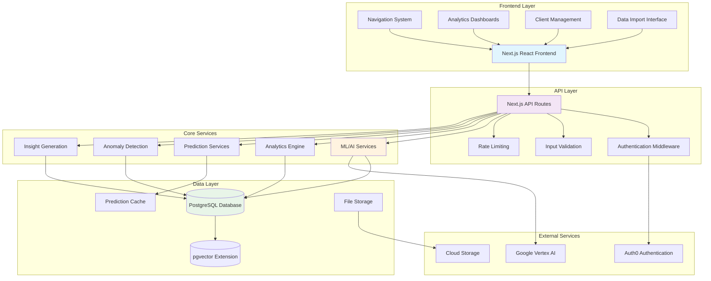
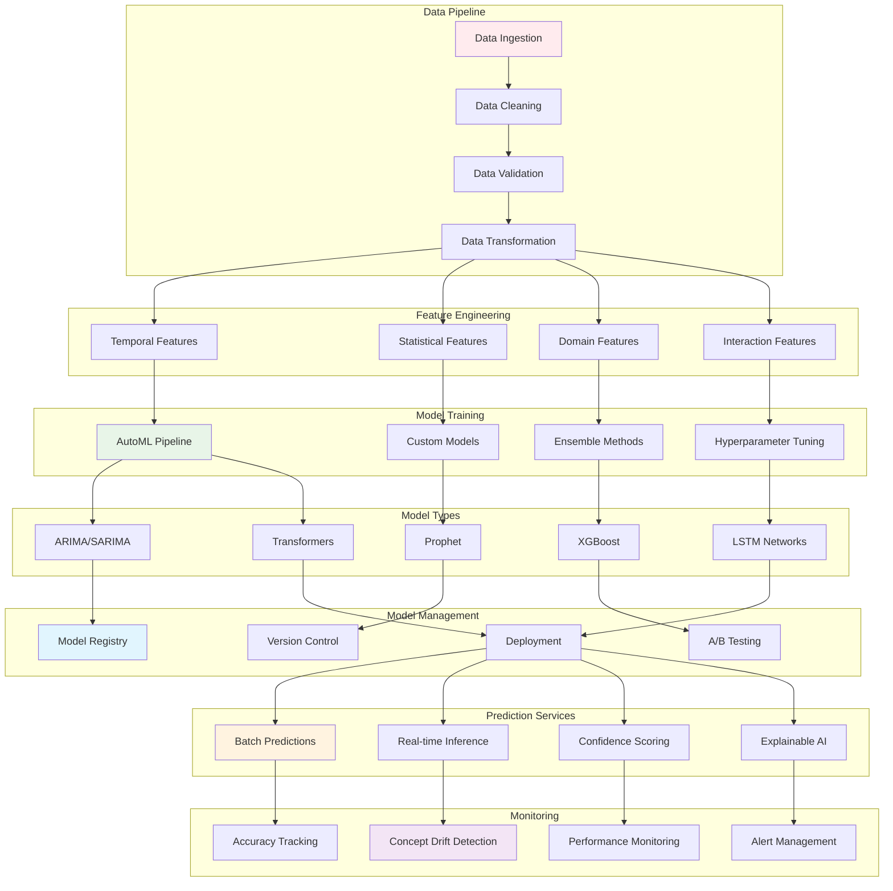
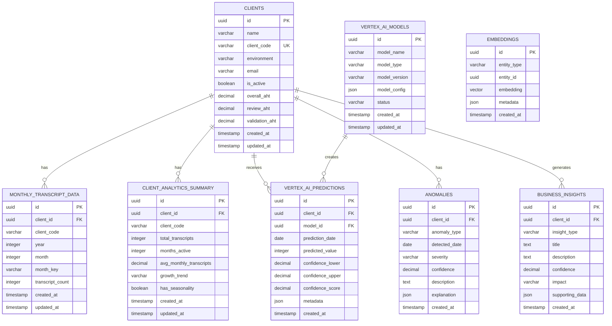
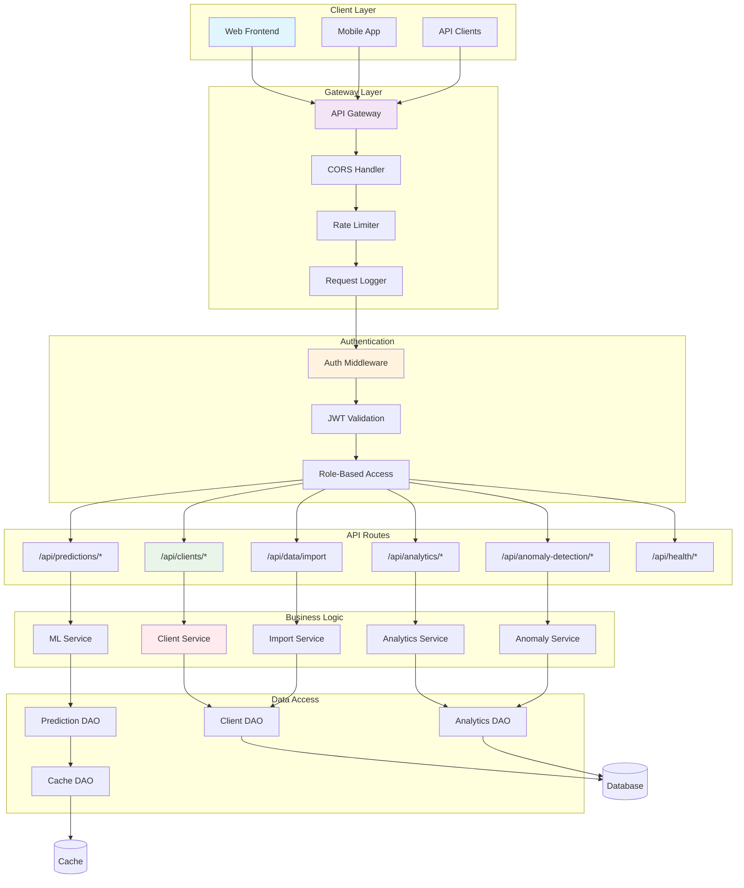
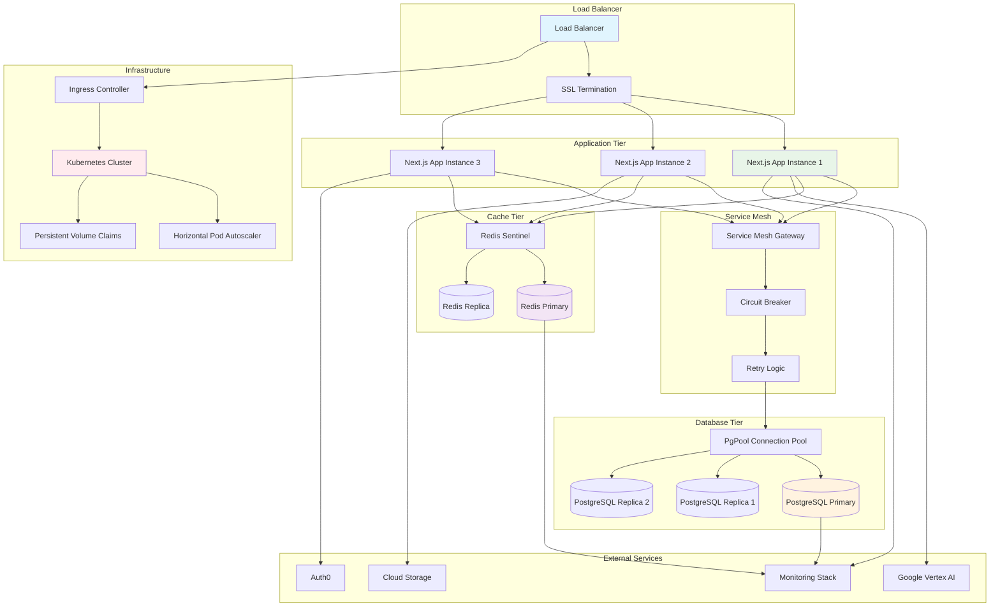
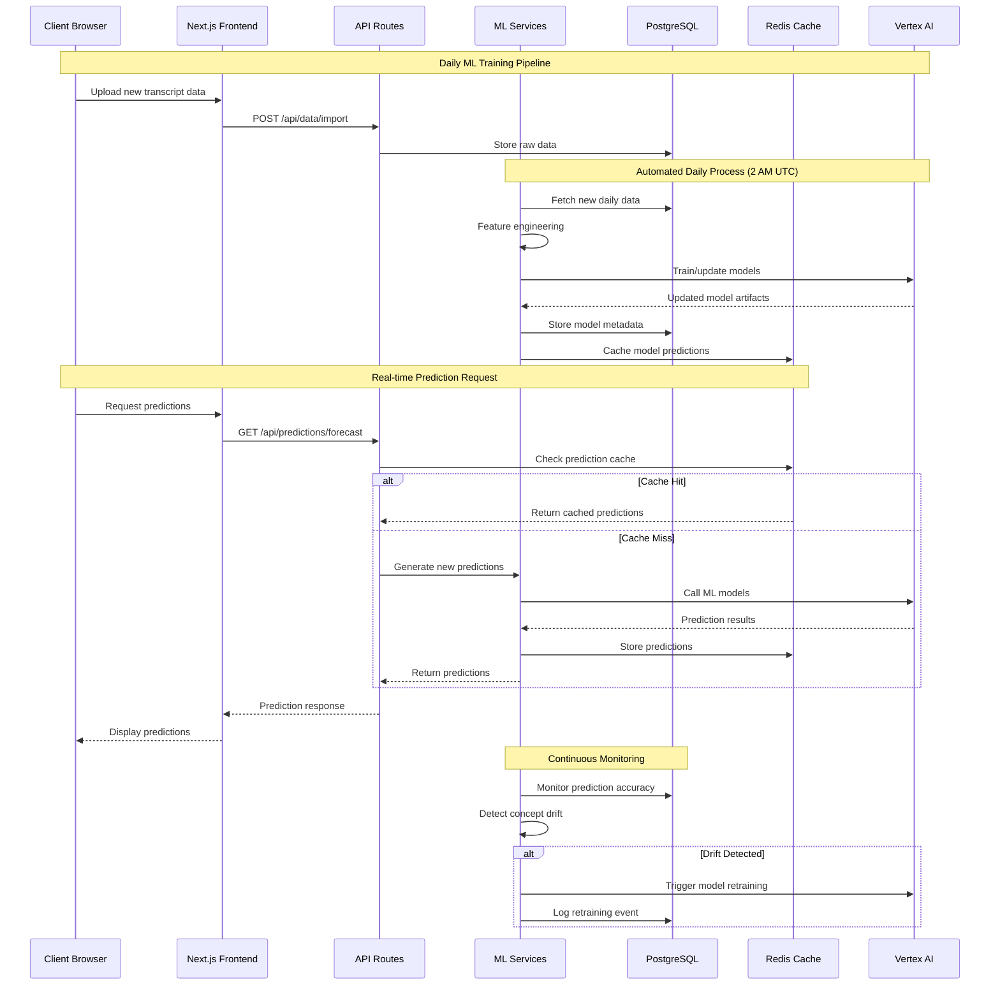
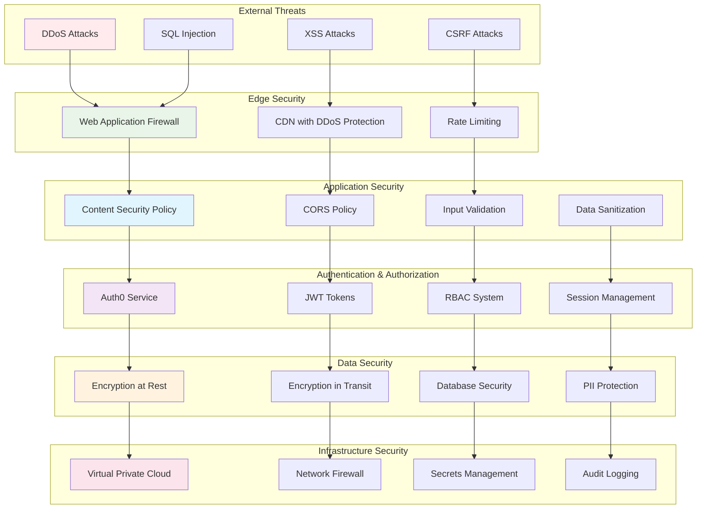

# Architecture Diagrams

This document contains comprehensive system architecture diagrams using Mermaid to visualize the Transcript Analytics Platform's structure and data flow.

## System Overview Architecture

## Machine Learning Architecture

## Database Schema Architecture

## API Architecture

## Deployment Architecture

## Data Flow Architecture

## Security Architecture

