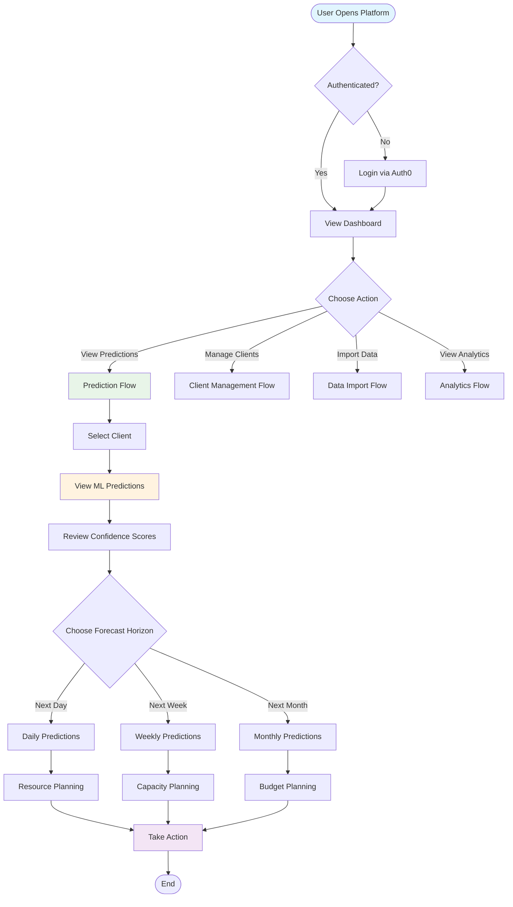
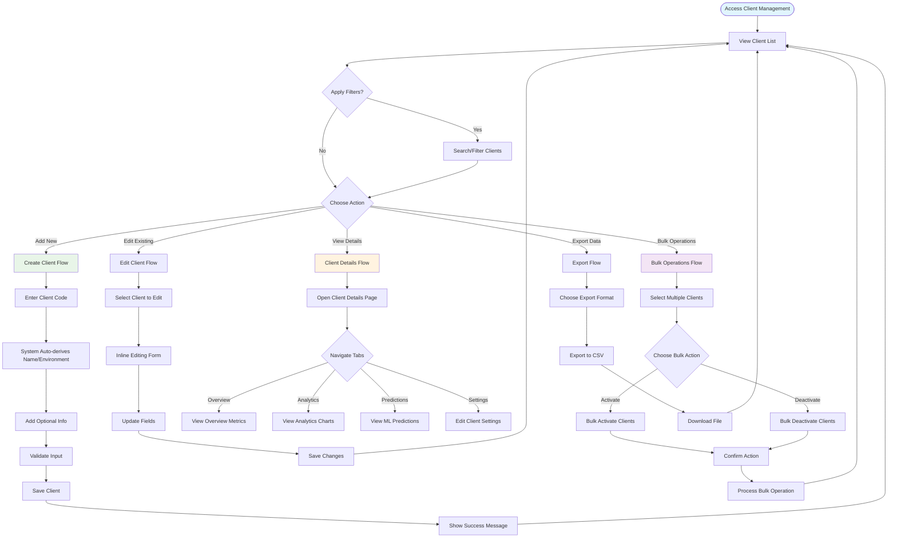
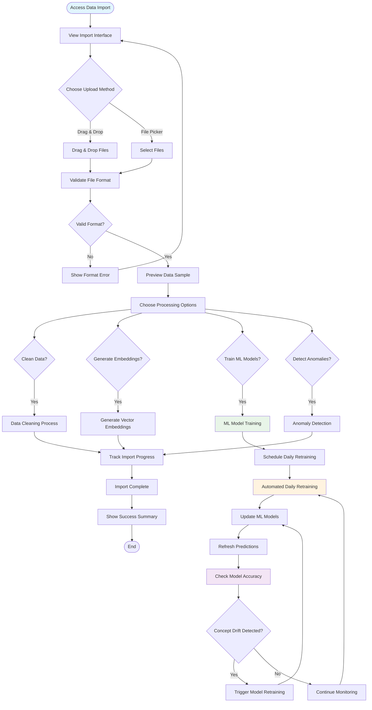
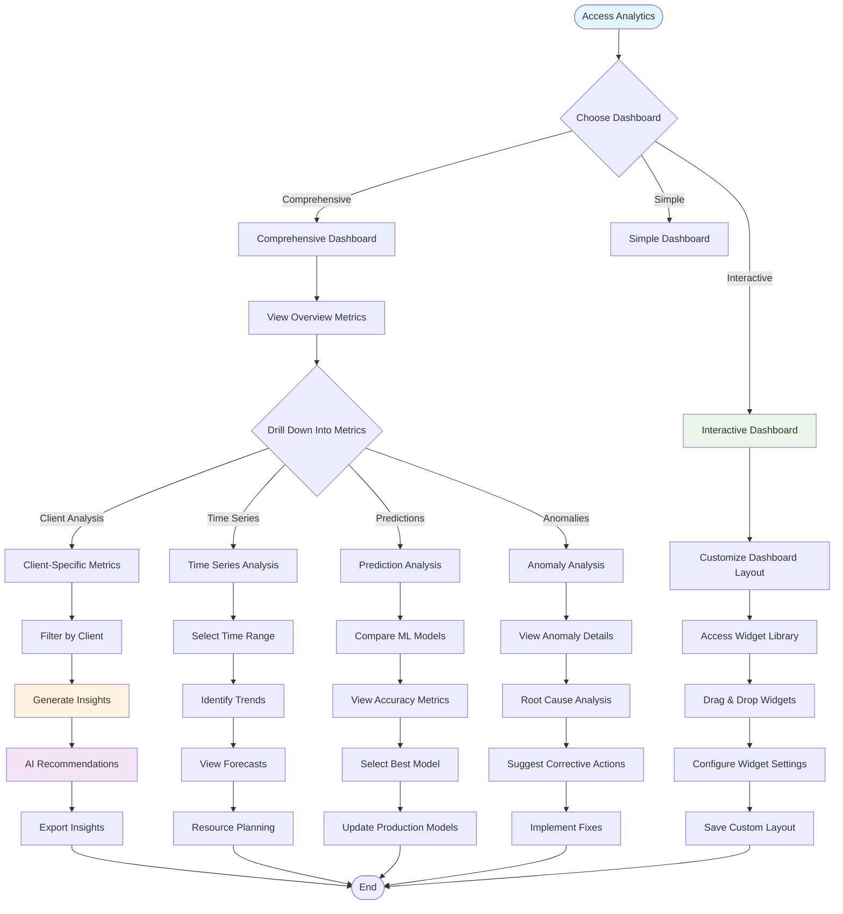
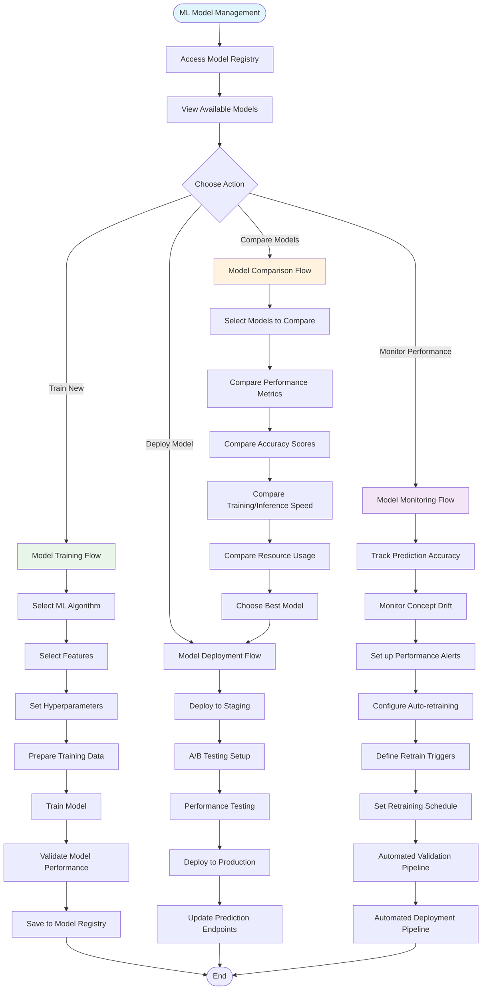
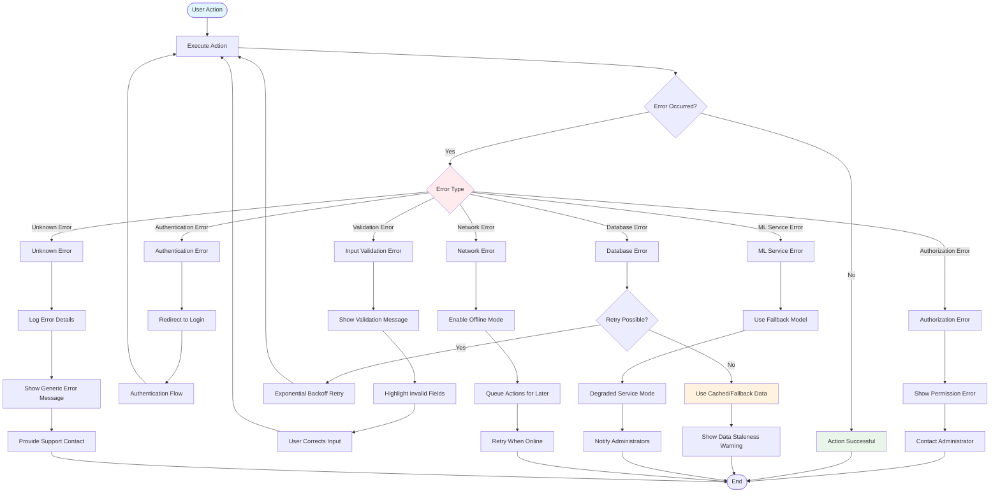

# User Flow Diagrams

This document contains comprehensive user flow diagrams using Mermaid to visualize how different users interact with the Transcript Analytics Platform.

## Primary User Flow: ML-Powered Transcript Prediction

## Client Management User Flow

## Data Import and ML Training Flow

## Analytics Dashboard User Flow

## ML Model Management Flow

## Error Handling and Recovery Flow

